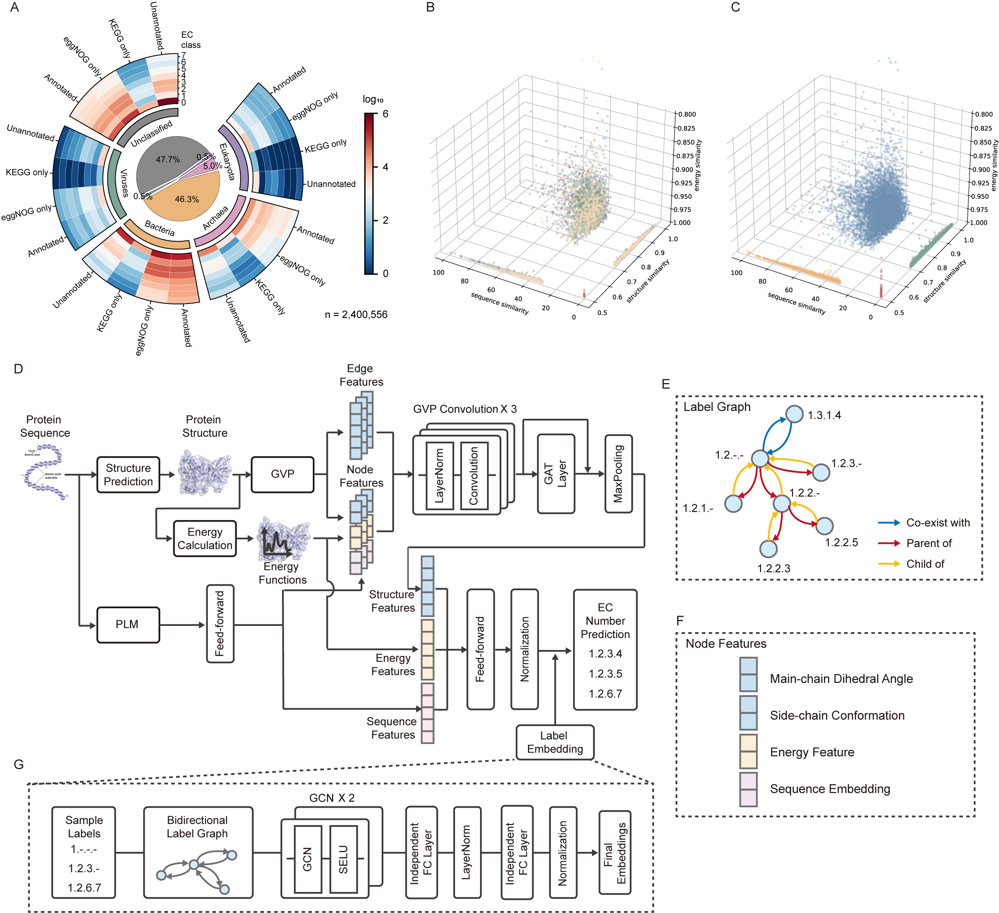

# Decoding the Energetic Blueprint of Extremophile Enzyme: ​A Multimodal AI Framework for Functional Discovery Beyond Sequence and Structure Homology​.

## 🧬 Project Overview
**ACCESS** is a specialized open-source Python package in the field of biomanufacturing. It aims to offer high-precision EC number prediction for the rational design of industrial enzymes, screening of functional proteins, and enzyme reaction optimization using MIT license. By combining 3D protein structural features, side-chain features, and residue-level Rosetta energy, it uses a hybrid graph neural network architecture. Based on hierarchical contrastive learning and multi-label adaptive fine-tuning, it predicts protein functions. Through a topology-aware gradient attention mechanism, it precisely locates function - critical residues. This approach pioneers a multimodal feature fusion graph neural network architecture and an interpretable AI algorithm (“Activity Existence - EC Prediction - Rational Design”), surmounting the limitations of conventional tools.

[**Installation**](https://access-1.readthedocs.io/en/latest/content/00_Installation.html) **-** 
[**Quick start**](https://access-1.readthedocs.io/en/latest/content/01_Basic_Usage.html) **-** 
[**Tutorial**](https://access-1.readthedocs.io/en/latest/Tutorials/index.html) **-** 
[**Documentation**](https://access-1.readthedocs.io/en/latest/index.html) 

## Discussion 
Please use GitHub [issues](https://github.com/BGI-Qingdao/ACCESS/issues) tracker for reports and discussions of:
 - Bug reports
 - Document and data issues
 - Feature requirements
 - ...

## Contribution 
**ACCESS** is in a stage of rapid development so that we will carefully consider all aspects of your proposal. We hope future input will be given by both users and developers.

