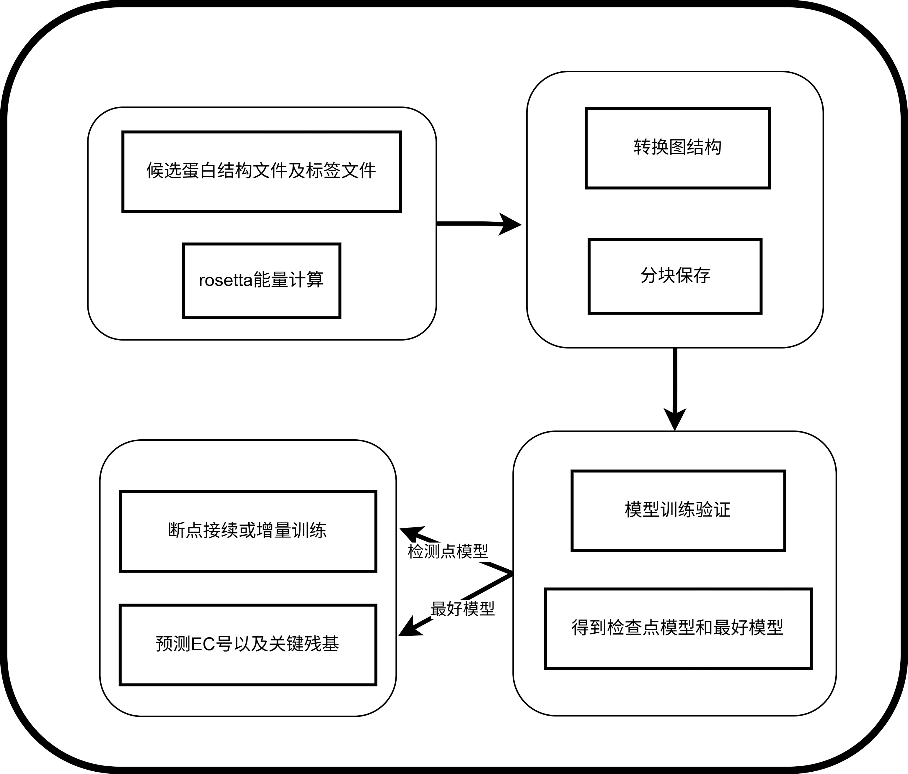

.. _basic-usage:

Basic Usage 
================

Workflow
---------

Usage
--------------

A Guide to Rosetta Energy Calculation
++++++++++++++++++++++++++++++++++++++++++++++++
Directory Structure
***************************

The Rosetta project directory is organized in a hierarchical manner to facilitate efficient workflow and computation. 
Below is an illustrative structure:

.. code-block:: bash
   :caption: Rosetta Project Directory Structure

   rosetta/
   ├── pdb/                      # Directory for storing original PDB files
   ├── pdb_list/                # Task list file directory
   ├── pdb_rosetta/             # Directory for storing calculation results
   ├── features.xml             # Rosetta feature definition file
   ├── rosetta_feature.sh       # Main script
   ├── rosetta_feature_sub.sh   # Sub-task scheduling script
   └── rosetta_feature_parallel.sh  # Parallel computing script

Single - Task Calculation
****************************

Follow these steps to perform a single - task calculation:

.. code-block:: bash

    # Go to the working directory
    cd rosetta
    
    # 1. Put the PDB file into the Pdb/ directory
    # 2. Edit the task list pdb_list.txt and save it to pdb_list/
    
    # Run single - task calculation
    bash rosetta_feature.sh

Parallel Computing
****************************

For parallel computing, follow these steps:

.. code-block:: bash

    cd rosetta
    
    # 1. Split the task list (n is the number of lines per sub - task file)
    cd pdb_list
    split -l n -d -a 3 --additional-suffix=.txt pdb_list.txt list_part_
    cd ..
    # 2. Submit parallel tasks
    bash rosetta_feature_sub.sh

Rosetta feature include
****************************

.. table::
   :widths: auto
   :align: left

   +------------------------+-------+----------------------------------------------------+
   | Name                   | Type  | Description                                        |
   +========================+=======+====================================================+
   | total_score            | float | Total score of the protein                         |
   +------------------------+-------+----------------------------------------------------+
   | dslf_fa13              | float | Long-range interaction score                       |
   +------------------------+-------+----------------------------------------------------+
   | fa_atr                 | float | Attractive Van der Waals interaction score         |
   +------------------------+-------+----------------------------------------------------+
   | fa_dun                 | float | Disulfide bond penalty term                        |
   +------------------------+-------+----------------------------------------------------+
   | fa_elec                | float | Charge interaction score                           |
   +------------------------+-------+----------------------------------------------------+
   | fa_intra_rep           | float | Intramolecular repulsion score                     |
   +------------------------+-------+----------------------------------------------------+
   | fa_intra_sol_xover4    | float | Intramolecular solvation crossover term score      |
   +------------------------+-------+----------------------------------------------------+
   | fa_rep                 | float | Intermolecular repulsion score                     |
   +------------------------+-------+----------------------------------------------------+
   | fa_sol                 | float | Solvation score                                    |
   +------------------------+-------+----------------------------------------------------+
   | hbond_bb_sc            | float | Backbone-sidechain hydrogen bond score             |
   +------------------------+-------+----------------------------------------------------+
   | hbond_lr_bb            | float | Long-range backbone hydrogen bond score            |
   +------------------------+-------+----------------------------------------------------+
   | hbond_sc               | float | Sidechain hydrogen bond score                      |
   +------------------------+-------+----------------------------------------------------+
   | hbond_sr_bb            | float | Short-range backbone hydrogen bond score           |
   +------------------------+-------+----------------------------------------------------+
   | lk_ball_wtd            | float | Spherical weighted connectivity score              |
   +------------------------+-------+----------------------------------------------------+
   | omega                  | float | Dihedral angle constraint score                    |
   +------------------------+-------+----------------------------------------------------+
   | p_aa_pp                | float | Amino acid preference score                        |
   +------------------------+-------+----------------------------------------------------+
   | pro_close              | float | Proline closure score                              |
   +------------------------+-------+----------------------------------------------------+
   | rama_prepro            | float | Ramachandran map preprocessing score               |
   +------------------------+-------+----------------------------------------------------+
   | ref                    | float | Reference score                                    |
   +------------------------+-------+----------------------------------------------------+
   | yhh_planarity          | float | Aromatic ring planarity score                      |
   +------------------------+-------+----------------------------------------------------+
   | cavity_volume          | float | Cavity volume of the protein                       |
   +------------------------+-------+----------------------------------------------------+
   | contacts               | float | Number of contacts                                 |
   +------------------------+-------+----------------------------------------------------+
   | degree                 | float | Degree of connectivity                             |
   +------------------------+-------+----------------------------------------------------+
   | exposed_hydrophobics   | float | Exposed hydrophobic residues count                 |
   +------------------------+-------+----------------------------------------------------+
   | exposed_polars         | float | Exposed polar residues count                       |
   +------------------------+-------+----------------------------------------------------+
   | exposed_total          | float | Total exposed residues count                       |
   +------------------------+-------+----------------------------------------------------+
   | net_charge             | float | Net charge                                         |
   +------------------------+-------+----------------------------------------------------+
   | nres                   | int   | Number of residues                                 |
   +------------------------+-------+----------------------------------------------------+
   | packstat               | float | Burial statistics score                            |
   +------------------------+-------+----------------------------------------------------+
   | unsat_hbond2           | float | Unsaturated hydrogen bond score                    |
   +------------------------+-------+----------------------------------------------------+

Data Preparation and Training/Inference Modules
+++++++++++++++++++++++++++++++++++++++++++++++++++++++++++

Data Preparation Module
*****************************************

This module is designed to prepare your data for further processing and training. It organizes and processes raw PDB files, embeddings, and labels into a structured format suitable for model training.

Command Syntax
~~~~~~~~~~~~~~~~~~~~~~~~
.. code-block:: bash

    python ./access/data/data_prepare.py \
      --pdb_dir /path/to/pdb_files \
      --include_dir /path/to/include_files \
      --embedding_dir /path/to/embedding_output \
      --processed_dir /path/to/processed_output \
      --label_file labels.csv \
      [--split_mode STRATEGY] \
      [--num_workers NUM] \
      [--seed SEED]

Mandatory Arguments
~~~~~~~~~~~~~~~~~~~
+--------------------+----------------------------------------------------+
| Argument           | Description                                        |
+====================+====================================================+
| ``--pdb_dir``      | Directory containing input PDB files               |
+--------------------+----------------------------------------------------+
| ``--include_dir``  | Directory containing filter/label files            |
+--------------------+----------------------------------------------------+
| ``--embedding_dir``| Base output directory for generated embeddings     |
+--------------------+----------------------------------------------------+
| ``--processed_dir``| Output directory for processed datasets            |
+--------------------+----------------------------------------------------+
| ``--label_file``   | CSV file containing data labels                    |
+--------------------+----------------------------------------------------+

Optional Parameters
~~~~~~~~~~~~~~~~~~~
+----------------------+---------------------+-----------------------------+
| Argument             | Default Value       | Description                 |
+======================+=====================+=============================+
| ``--split_mode``     | all_test            | Data splitting strategy:    |
|                      |                     |                             |
|                      |                     | - train_split (8:1:1)       |
|                      |                     | - all_train                 |
|                      |                     | - all_valid                 |
|                      |                     | - all_test                  |
+----------------------+---------------------+-----------------------------+
| ``--num_workers``    | 64                  | Number of parallel workers  |
+----------------------+---------------------+-----------------------------+
| ``--seed``           | 42                  | Random seed for splitting   |
+----------------------+---------------------+-----------------------------+

Training Module
*****************************************

The training module is responsible for training the model on the prepared dataset. It leverages the processed data to learn patterns and relationships within the protein structures.

Command Syntax
~~~~~~~~~~~~~~~
.. code-block:: bash

    python ./access/training/train.py \
      --root_dir ./access/gvp_protein_embedding/processed \
      --resultFolder ./access/result \
      [--batch_size SIZE] \
      [--num_workers NUM]

Parameters
~~~~~~~~~~
+-------------------+---------------------+---------------------------+
| Argument          | Default Value       | Description               |
+===================+=====================+===========================+
| ``--root_dir``    | Required            | Root directory of         |
|                   |                     | processed datasets        |
+-------------------+---------------------+---------------------------+
| ``--resultFolder``| Required            | Output directory for      |
|                   |                     | models and results        |
+-------------------+---------------------+---------------------------+
| ``--batch_size``  | 8                   | Training batch size       |
+-------------------+---------------------+---------------------------+
| ``--num_workers`` | 2                   | Data loader workers       |
+-------------------+---------------------+---------------------------+

Inference Module
*****************************************

Once the model is trained, the inference module allows you to make predictions on new data. It uses the trained model to generate predictions based on the input data.

Command Syntax
~~~~~~~~~~~~~~~
.. code-block:: bash

    python ./access/inference/inference.py \
      --model ./access/saved_models/best_model.pt \
      --root_dir ./access/gvp_protein_embedding/processed \
      --resultFolder ./access/result \
      [--print_true_label] \
      [--print_embedding] \
      [--batch_size SIZE] \
      [--num_workers NUM]

Mandatory Arguments
~~~~~~~~~~~~~~~~~~~
+----------------------+-------------------------------------------------+
| Argument             | Description                                     |
+======================+=================================================+
| ``--model``          | Path to trained model file (.pt)                |
+----------------------+-------------------------------------------------+
| ``--root_dir``       | Root directory of processed datasets            |
+----------------------+-------------------------------------------------+
| ``--resultFolder``   | Output directory for inference results          |
+----------------------+-------------------------------------------------+

Optional Flags
~~~~~~~~~~~~~~
+------------------------+-----------------------------------------------+
| Argument               | Description                                   |
+========================+===============================================+
| ``--print_true_label`` | Display true labels in output                 |
+------------------------+-----------------------------------------------+
| ``--print_embedding``  | Output embeddings in results                  |
+------------------------+-----------------------------------------------+

Optional Parameters
~~~~~~~~~~~~~~~~~~~
+------------------+---------------------+---------------------------+
| Argument         | Default Value       | Description               |
+==================+=====================+===========================+
| ``--batch_size`` | 8                   | Inference batch size      |
+------------------+---------------------+---------------------------+
| ``--num_workers``| 2                   | Data loader workers       |
+------------------+---------------------+---------------------------+

Usage Notes
--------------
1. File Path Requirements:

   - All directory arguments require absolute paths or paths relative to execution context

   - Ensure write permissions for output directories

2. Performance Recommendations:

   - Set ``--num_workers`` to 2 for GPU and 16 for CPU.

   - Use ``--batch_size`` with 8 for GPU and 64 for CPU.

